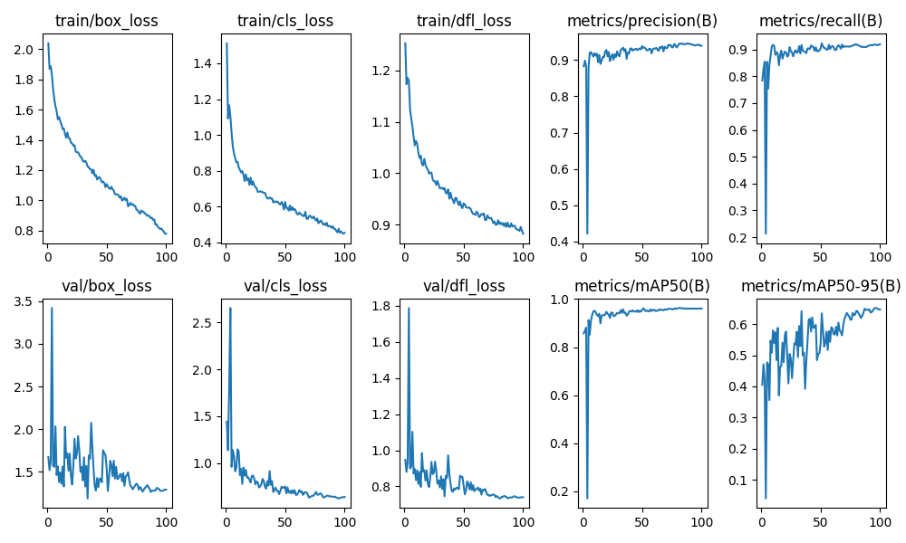
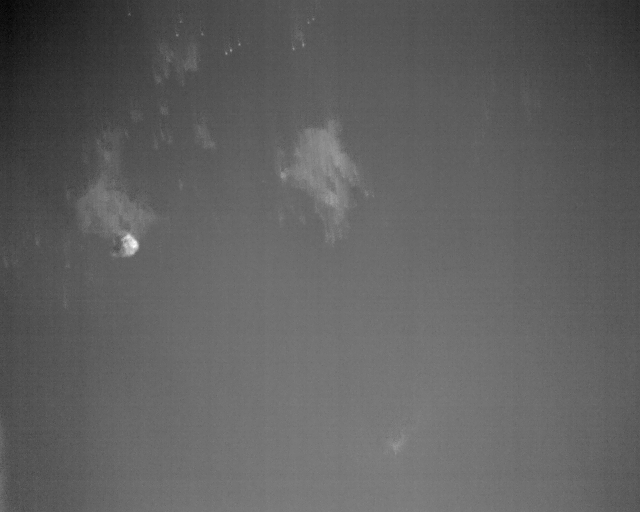
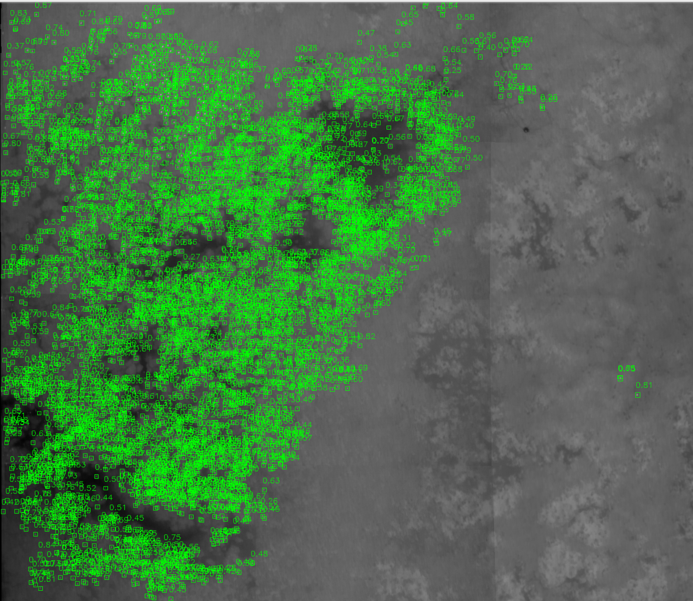
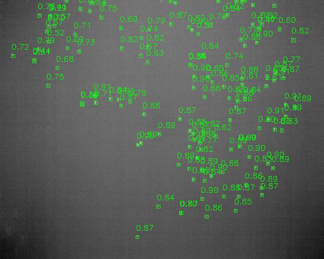
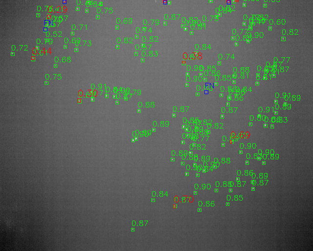

# Waterfowl detection on thermal images.
## Training Pipline
### Dataset Setting
- Training with both positive and negative samples
- Train/Valid ration is 0.85/0.15
- Testing on practical orthomosaic images.
**The dataset the link provide has a wrong groundtruth for the proactical test image, we need switch to version 3.**
To match the test groundtruth with training data, we need to enlarge the box from 5 pixels to 7 pixels.

### Data Agument
- **Split Original images with tile size 128, and train the model with size 512.**
- Balance 
- Random Flip: Filp in horizontal and vertical direction.
- Copy Paste: Copy and paste objects to other images.
- Mosaic

### Model
We tried RTDETR and YOLO.

### Metrics
Since it's binary classify, we use **Precision**, **Recall** and **F1 Score** with with IOU in [25%, 90%].

# Experiment
## Models Performance in IOU 25%
|Model|Image Size|Image Split|Augment|Epochs|Precision|Recall|F1|
|---|---|---|---|---|---|---|---|
|rtdetr-l.pt|512|No|No|0|0.8981|0.3750|0.5290|
|rtdetr-l.pt|640|No|No|0|0.8509|0.4130|0.5561|
||||||
|yolo11l.pt|640|No|No|350|0.9502|0.3732|0.5360|
|yolo11m.pt|1024|No|No|100|0.9636|0.3904|0.5557|
|yolo11m.pt|1024|No|No|1000|0.9720|0.4048|0.5716|
||||||
|yolo11x.pt|640|No|No|350|0.9487|0.3297|0.4893|
|yolo11x.pt|640|Yes|No|350|0.9438|0.3918|0.5537|
||||||
|yolo11m.pt|512|Yes|Yes|100|0.9432|0.8953|0.9186|

From this table, we can see:
- **RTDETR** model has better **recall** than yolo on original training dataset.
- Traing with **large image size** can improve the precision. **More epochs** helps as well.
- Apperate data augment also improve the **recall**.
- Training on splited tile balanced dataset could improve the performance dramstically.

## Best Model Metrics
**Training Metrics**

**Performance**
|Dataset|Recall|mAP50|mAP50-95|
|---|---|---|---|
|Validation|0.917|0.96|0.646|
|Test|0.4840|0.5099|0.3821|
|Postive(Val)Image|0.9312|0.9682|0.8107

## Analysis 
What are the strengths and weaknesses of thermal imagery for this task?
### The strengths
Comparing to **RGB**, it captures creatures with body heat, distinguish them from low temperature background objects like grass.

  
  

### The Weaknesses
UAV-Based Thermal Imageries is took from far distance, so the targets we want to detect is very small in the images.
## Visualization and Error Analysis
### Result on test orhomosaic image

### Result on random validation image

### Error Visulization
